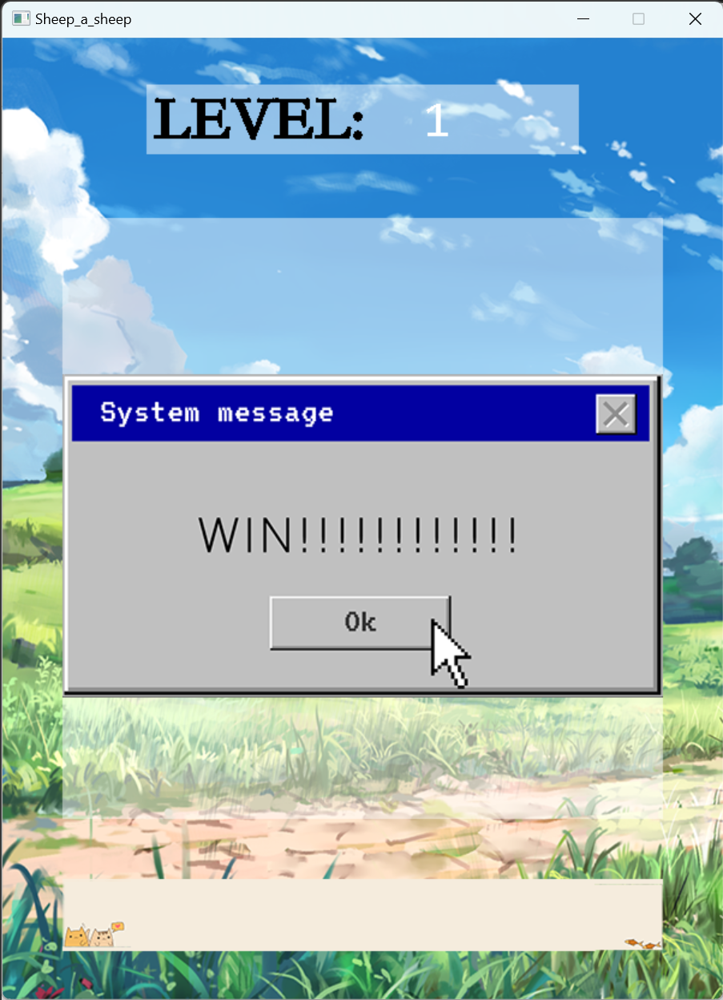
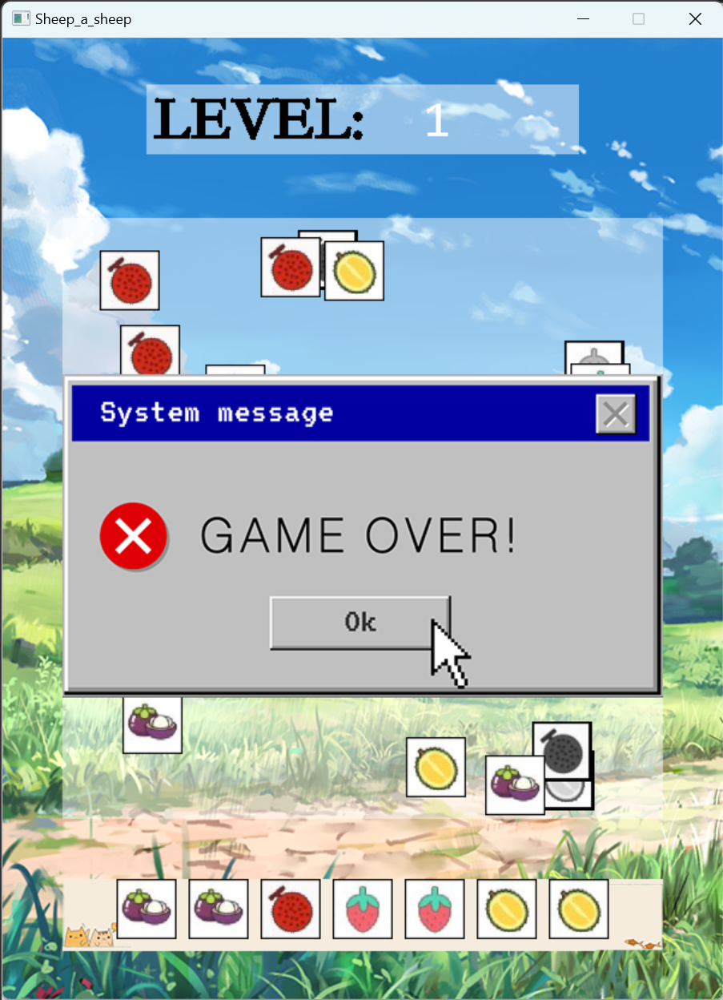
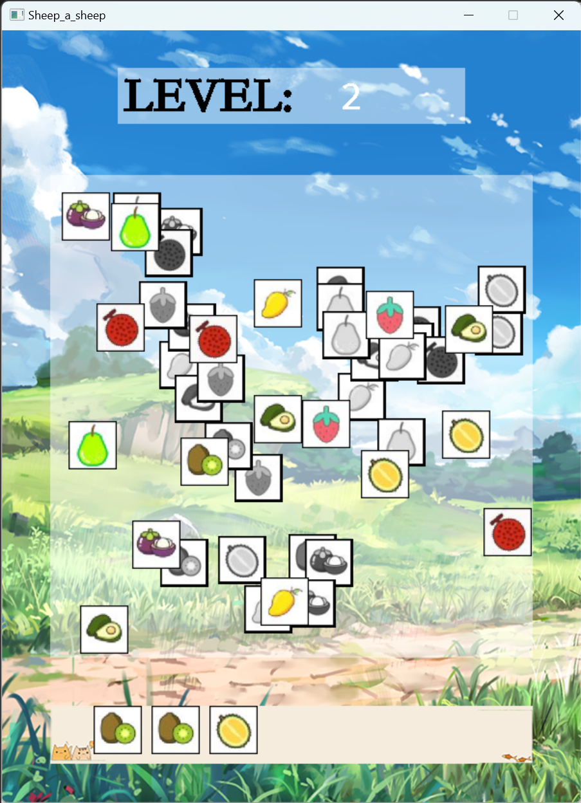

# 羊了个羊（C++ & EasyX）

## 项目简介/Project Introduction
一款基于C++和EasyX开发的热门三消小游戏。
如果您喜欢这个项目，请给我一个🌟Star🌟吧！

## 项目特点/Project Features
开发难度低：项目总体难度低，适合初学者参考学习。
图形界面：引入EasyX图形库，使得游戏界面更加美观。
关卡式设计：游戏提供多个关卡，难度逐渐提升。
参数可调：关卡难度、图案数量定义于代码开头部分，可根据需要进行调整。

## 游戏规则/Game Rules
游戏开始时，地图中会随机生成一定数量的图案。关卡数越大，图案数量越多。
玩家通过点击画面内的图案，将其转移到画面下方的卡槽中，卡槽的存放上限为7。
如果卡槽中相同的图案达到3个则会消除。当地图中的图案全部消除后，通过该关卡，难度升级。
如果卡槽中的图案达到上限，则游戏结束。

## 开发环境/Development Environment
- Windows 11
- Visual Studio 2022
- EasyX 2023_大暑版

## 安装使用/Installation & Usage
### 玩家
[>点击这里<](https://github.com/CCLMSY/Sheep_a_sheep/blob/master/Release.zip)下载并解压压缩包，双击 `Sheep_a_sheep.exe` 运行游戏。
### 开发者
确保你的系统已安装 EasyX 图形库。
1. 克隆仓库：
   ```sh
   git clone https://github.com/CCLMSY/Sheep_a_sheep
   ```
2. 打开 `Sheep_a_sheep/main.cpp` 文件，可查看和编辑项目源码。代码中用到的素材位于 `Sheep_a_sheep/src` 文件夹下。
3. 如果你使用的是 Visual Studio ，且环境搭建正确，可以在 Visual Studio 中打开 `Sheep_a_sheep.sln` 解决方案文件，可以直接查看项目并编译运行。

## 项目结构/Project Structure
```
.
├── README.md
├── Screenshots
│   ├── 1.png
│   ├── 2.png
│   └── 3.png
├── Release.zip
├── Sheep_a_sheep
│   ├── src
│   │   └── \*.png
│   └──main.cpp
└── x64
    └── Release
        ├── src
        │   └── \*.png 
        ├── Sheep_a_sheep.exe
        └── Sheep_a_sheep.pdb
```

## 素材来源/Source of Materials
背景图片；来源于网络，经个人修改，如有侵权，请联系删除。
方块图案；[阿里巴巴矢量图标库](https://www.iconfont.cn/)

## 项目截图/Project Screenshots




## 许可协议/License
[MIT Lisence] © 2023 CCLMSY